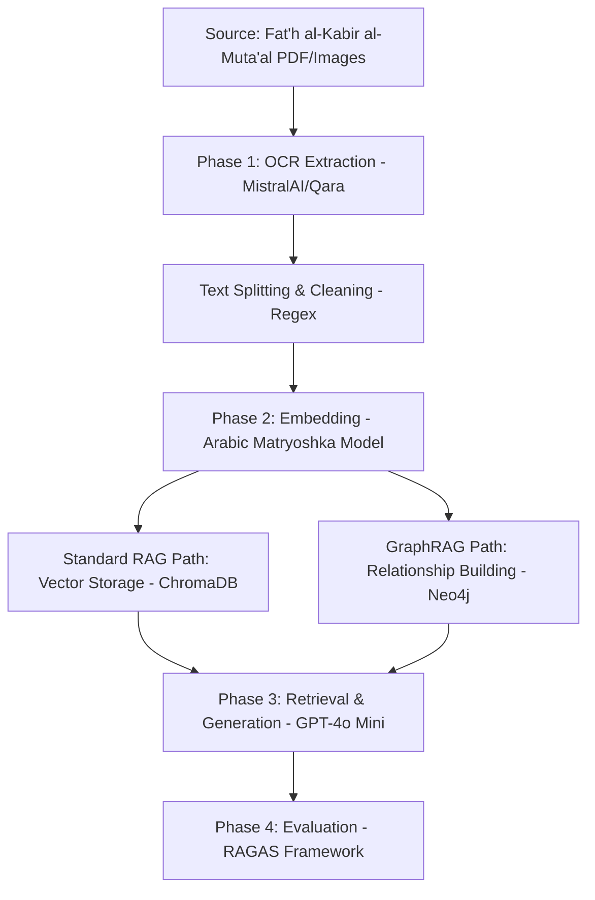

# 📜 Shura7 Al-Sh3er (Arabic Poetry Expert System)

An advanced expert system specialized in analyzing and parsing the **Arabic Mu'allaqat** using dual RAG architectures: **Standard RAG (Vector-based)** and **GraphRAG (Relationship-based)**.

## 👥 Developers
* **Haya Alwizrah** (Haya-Alwizrah)
* **Sarah ALowjan** (Sarah ALowjan)

## 🏗️ Project Architecture
The system follows a strict data lifecycle from raw document extraction to final AI evaluation.

## 🛠️ Technical Stack

* **LLM:** OpenAI `gpt-4o-mini` for high-accuracy reasoning.
* **Embeddings:** `Sarah0001/Arabic_embed_model` for specialized Arabic semantic representation.
* **Databases:**
* **ChromaDB:** Vector store for semantic search.
* **Neo4j AuraDB:** Knowledge graph for structural parsing (Verse → Grammar → Meaning).

* **Frameworks:** Streamlit, LangChain, Ragas.

## 📚 Dataset

Currently, the system covers a curated dataset of 3 major pre-Islamic Mu'allaqat:

1. **Al-A'sha**
2. **'Antara ibn Shaddad**
3. **Labid ibn Rabi'ah**

## 📊 Evaluation Metrics

Using the **RAGAS** framework, we evaluate both systems based on:

* **Faithfulness:** Ensures the AI doesn't hallucinate facts outside the poetry context.
* **Answer Relevancy:** Measures how directly the AI answers the user's linguistic query.
* **Context Precision/Recall:** Evaluates the search engines' ability to retrieve complete parsing data.

## 🚀 Getting Started

1. Install dependencies: `pip install -r requirements.txt`
2. Configure `.env` with your OpenAI and Neo4j credentials.
3. Run the dashboard: `streamlit run app.py`

---

